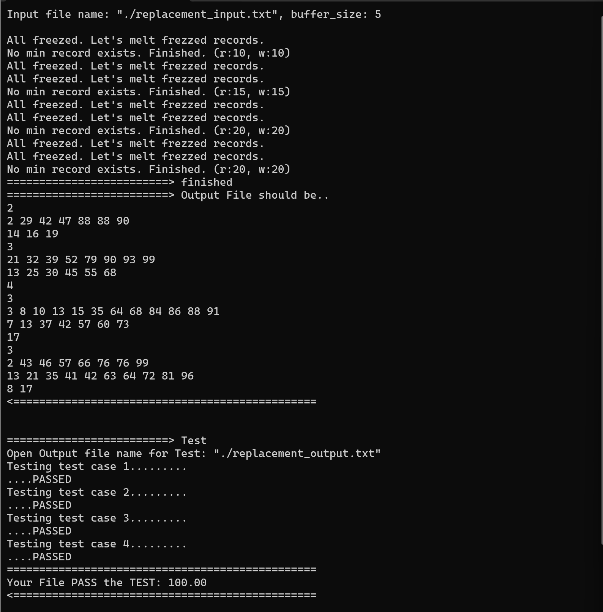
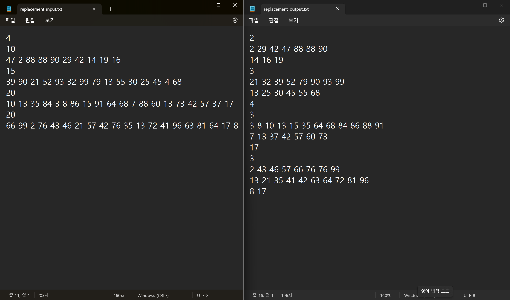

# 파일처리론 과제 #1 Replacement Selection(대체선택) 구현

이 보고서는 **파이썬(python 3.12.7)** 에서 **Replacement Selection (대체 선택)** 기법을 구현한 `TestCase` 클래스를 포함한 다양한 코드 예제에 대한 설명과 사용 방법을 다룹니다.
**Replacement Selection**은 정렬된 데이터를 효율적으로 생성하기 위해 사용되는 알고리즘입니다.
이 기법은 **버퍼(buffer)** 를 통해 데이터를 정렬하고 조건을 만족하는 값을 최소화하여, **최종 결과(sorted_runs)** 에 삽입하는 방식으로 동작합니다.


## Table of contents
1. [TestCase 클래스 개요](#TestCase-클래스-개요)
2. [`update_freeze_flag()` 메서드](#update_freeze_flag-메서드)
3. [`find_min_index()` 메서드](#find_min_index-메서드)
4. [`pop_min_values()` 메서드](#pop_min_values-메서드)
5. [`initialize_buffer()` 메서드](#initialize_buffer-메서드)
6. [파일 입출력 코드 설명](#파일-입출력-코드-설명)
7. [프로그램 실행 결과](#프로그램-실행-결과)
8. [구현 과정의 주요 난관과 해결 전략](#구현-과정의-주요=난관과-해결-전략)

---
## TestCase 클래스 개요
`TestCase` 객체가 생성될 때, `BUffer_SIZE`, `buffer`, `freeze_flags`, `sorted_runs`, `current_run`, `runcount`, `last_popped` 초기화

```python
    class TestCase:
    
    BUFFER_SIZE = 5  # 버퍼 크기 = 5
    buffer = [None for _ in range(BUFFER_SIZE)]
    freeze_flags = [None for _ in range(BUFFER_SIZE)]
    sorted_runs = []  # 2차원 배열로 결과를 저장
    current_run = []
    run_count = 1
    last_popped = 0      
```

 * **`BUFFER_SIZE` :** 버퍼의 크기 지정
 * **`buffer` :** 버퍼의 내용을 저장하는 리스트, 초깃값은 `None`

 * **`freeze_flags` :** 특정 조건을 만족하는지의 여부를 확인하는 리스트

 * **`sorted_runs` :** 만들어진 `Run`리스트를 저장하는 최종 결과 리스트

 * **`current_run` :** `buffer`에서 `pop`한 값을 저장하는 리스트

 * **`run_count` :** 생성된 `run`파일 카운트

 * **`last_popped` :** 현재 `pop`된 값, `update_freeze_flag`의 기준이 되는 값


## 생성자
입력된 `case_size`와 `case_values`를 받아 초기화
```python
    def __init__(self, case_size, case_values):  # case의 크기와 값이 담긴 리스트를 받음
        self.case_size = case_size
        self.case_values = list(map(int, case_values))  # 문자열을 정수로 변환  
```
 * **입력 인자 :** 
    * `case_size` : 해당 Test case의 크기
    * `case_value` : 해당 Test case의 값이 들어있는 리스트

* **동작 :** 
    * 문자열로 입력된 `case_values`를 `map(int, case_values)`를 사용하여 각각을 정수로 변환


---
## update_freeze_flag 메서드
새로운 값이 `buffer`에 들어갈 때, 해당 값의 "freeze" 상태를 업데이트, "freeze" 상태는 값이 `pop`될 수 있는지 여부를 결정

 ```python
    def update_freeze_flag(self, new_num, index):
        if new_num is None:  # None일 경우 True
            self.freeze_flags[index] = True
            return
        # 새로운 값이 last_popped보다 크거나 같으면 False, 작으면 True
        self.freeze_flags[index] = not new_num >= self.last_popped
 ```
 * **입력 인자 :**
    * **`new_num` :** `buffer`에 새로 들어온 숫자

    * **`index` :**  새 숫자가 저장된 `buffer`내의 인덱스

 * **작동 원리 :** 
    * `new_num`이 `last_popped`보다 크거나 같으면 `freeze_flags[index]`를 `False`로 설정하여 "freeze"상턔가 아님을 표시 

    * `new_num`이 `last_popped`보다 작거나 값이 `None`이면 `True`로 설정하여 "freeze"상태임을 표시
 ---
 ## find_min_index 메서드
 `buffer`에 있는 값들 중에서 `freeze_flags`가 `False`인 값들 중에서 최소값을 찾아 그 인덱스를 반환
 ```python
    def find_min_index(self):

        min_index = None
        min_value = 100  # 가장 큰 값으로 초기화
        for i in range(len(self.buffer)):
            if self.buffer[i] is not None and self.freeze_flags[i] and self.buffer[i] < min_value:
                min_index = i
                min_value = self.buffer[i]
        return min_index
 ```
 * **작동원리 :**

    * `min_index`, `min_value`를 각각 None과 100(가장 큰 값)으로 초기화

    * `buffer`를 순회하면서, `buffer[i]`가 `None`이 아니고, `freeze_flags[i]`가 `Flase`인 경우에만 해당 값을 검사

    * 최소값을 찾으면 해당 인덱스 `min_index`에 저장, 값을 `min_value`에 저장

    * 전체 탐색이 끝난 후 `min_index` 반환

---
## pop_min_values 메서드
`buffer`에서 최소값을 반복적으로 `pop`하여 `current_run`에 추가 (`freeze_flags` 상태에 따라 값을 추출)

```python
    def pop_min_values(self):
        while True:
            if any(self.freeze_flags):  # 하나라도 True가 있으면 실행
                min_index = self.find_min_index()
                if min_index is not None:
                    self.current_run.append(self.buffer[min_index])  # 버퍼의 최소값을 current_run에 추가
                    self.last_popped = self.buffer[min_index]  # last_popped 업데이트
                    self.buffer[min_index] = None  # 버퍼에서 pop된 값 삭제
                    self.freeze_flags[min_index] = True # freeze_flags 값 업데이트 (None일 때도 True)

                    # case_values에 값이 남아 있는 경우 Buffer와 Freeze에 새 값 추가
                    if self.case_values:
                        self.buffer[min_index] = self.case_values.pop(0)
                        self.update_freeze_flag(self.buffer[min_index], min_index)

            else:
                # 버퍼에 숫자가 남아 있는 경우(모두 freeze됨)
                if any(x is not None for x in self.buffer):
                    self.sorted_runs.append(self.current_run.copy())  # current_run 복사본을 sorted_runs에 추가
                    self.last_popped = 0  # last_popped 초기화
                    for i in range(len(self.freeze_flags)):
                        self.update_freeze_flag(self.buffer[i], i)
                    self.current_run = []  # current_run 초기화
                    self.run_count += 1

                else:  # 버퍼에 숫자가 남아 있지 않은 경우
                    self.sorted_runs.append(self.current_run.copy())  # 마지막 current_run을 sorted_runs에 추가
                    return self.sorted_runs
```
 * **작동 원리:** 
    * `while True` 루프를 사용하여 반복적으로 최소값을 `pop`
    * **조건 1 :** `freeze_flags`에서 하나라도 `True`인 값이 있으면 `find_min_index()` 메서드를 사용하여 최소값을 추출
        * 최소값을 `current_run`에 추가하고, `last_popped`를 해당 값으로 업데이트
        * 해당 값을 `buffer`에서 `None`으로 교체하고, 해당 인덱스의 `freeze_flags`를 `True`로 설정하여 해당 위치가 "freeze" 되도록 함.
        * `case_values`에 남아있는 값이 있다면 그 값을 `buffer`에 넣고 `update_freeze_flag()`로 "freeze" 상태를 업데이트

    * **조건 2:** 모든 `freeze_flags`가 `True`라면, 버퍼에 남아있는 값이 있으면 `sorted_runs`에 `current_run`을 복사하여 저장
        * `last_popped`를 0으로 초기화하여 다음 "run"을 준비 
        * `freeze_flags`를 재설정하고, `current_run`을 초기화

    * **조건 3:** `buffer`에 값이 남아있지 않으면, 마지막 `current_run`을 `sorted_runs`에 저장하고 결과를 반환


---
## initialize_buffer 메서드

`buffer`를 초기화하여 Test case에 맞게 값을 설정

```python
    def initialize_buffer(self):
        for i in range(self.BUFFER_SIZE):
            if i < self.case_size:  # case_size가 BUFFER_SIZE보다 클 경우 freeze_flags = Fasle
                self.buffer[i] = self.case_values.pop(0)  # 버퍼에 순서대로 값 입력
                self.freeze_flags[i] = False
            else:  # case_size가 BUFFER_SIZE보다 작을 경우 freeze_flags = True
                self.buffer[i] = None
                self.freeze_flags[i] = True
    
```
* **작동 원리 :** 
    * `BUFFER_SIZE`의 크기에 맞게 `buffer`를 채움
        * `case_size`가 `BUFFER_SIZE`보다 크면, `buffer`의 크기만큼 값을 넣고 나머지는 `None`으로 채움
        * `case_size`가 `BUFFER_SIZE`보다 작으면, `buffer`의 앞부분을 `case_values`의 값으로 채우고, 나머지는 `None`으로 채움
    * `buffer`의 값에 대해서 `freeze_flags`를 적절히 설정 
        * `case_size`가 `BUFFER_SIZE`보다 작으면 해당 인덱스의 `freeze_flags`는 `False`, 크면 `True`로 설정

---

## 파일 입출력 코드 설명
`replacement_input.txt`에서 정해진 방법으로 작성된 데이터를 읽고, 각 테스트 케이스의 결과를 정해진 방법으로 `replacement_output.txt`파일에 저장하는 작업을 수행하는 코드

### 코드 설명

#### 1. 파일 경로 설정
 
```python
# 파일 경로 설정
input_path = Path(__file__).parent / 'replacement_input.txt'
output_path = Path(__file__).parent / 'replacement_output.txt'
```
* **`input_path` :** 현재 파일의 디렉토리 기준으로 `replacement_input.txt`파일의 경로 설정

* **`output_path` :** 현재 파일의 디렉토리 기준으로 `replacement_output.txt`파일의 경로 설정

#### 2. 입력 및 출력 파일 열기
```python
# input File & output File
input_r = open(input_path, 'r')
output_w = open(output_path, 'w')
```
* **`input_r` :** 읽기 모드로 `replacement_input.txt`파일 열기

* **`output_r` :** 쓰기 모드로 `replacement_output.txt`파일 열기 

#### 3. 테스트 케이스 개수 읽기
```python
# 첫 번째 줄 = Test Case의 개수
test_case_count = int(input_r.readline())
```
* **`test_case_count` :** 첫번째 줄에서 테스트 케이스의  개수를 읽어 저장

#### 4. 테스트 케이스 데이터 읽기
```python
# 테스트 케이스 정보를 담을 리스트
test_case_sizes = []  # 각 Case의 길이 저장
test_case_values = []  # 각 Case의 값 리스트 저장

# 입력 파일에서 테스트 케이스 읽기
for i in range(test_case_count):
    test_case_sizes.append(int(input_r.readline()))
    test_case_values.append(input_r.readline().strip().split())
```
* **`test_case_sizes` :** 각 테스트 케이스의 길이를 저장하는 리스트
* **`test_case_values` :** 각 테스트 케이스의 값을 저장하는 리스트
* `for`문을 통해 각 테이스 케이스의 길이와 값을 읽어서 `test_case_sizes`와 `test_case_values`에 추가

#### 5. 테스트 케이스 처리 및 출력
```python
# 각 테스트 케이스에 대해 TestCase 객체를 생성하고 결과 작성
for i in range(test_case_count):
    case = TestCase(test_case_sizes[i], test_case_values[i])
    case.initialize_buffer()  # 버퍼 생성
    case.pop_min_values()  # 최소값 pop

    # 출력 파일에 run_count와 sorted_runs 내용을 작성
    output_w.write(f"{case.run_count}\n")
    for run in case.sorted_runs:
        output_w.write(" ".join(map(str, run)) + "\n")  # sorted_runs의 내용을 출력
```
* 각 테스트 케이스마다 `TestCase` 객체를 생성하고, `initialize_buffer()`와 `pop_min_values()` 메서드를 호출하여 정렬 작업 수행

* `run_count`를 출력 파일에 기록하고, 각 `sorted_runs`의 내용을 공백으로 구분하여 파일에 작성

#### 6. 파일 닫기
```python
# 파일 닫기
input_r.close()
output_w.close()
```
* 모든 작업이 끝난 후 파일 닫기


### 파일 입출력 예시
#### 입력 파일 예시(`replacement_input.txt`)
```python
2                                           # 테스트 케이스 개수
10                                          # 첫번째 테스트 케이스 길이 
47 2 88 88 90 29 42 14 19 16                # 첫번째 테스트 케이스 값
15                                          # 두번째 테스트 케이스 길이
39 90 21 52 93 32 99 79 13 55 30 25 45 4 68 # 두번째 테스트 케이스 값
```
#### 출력 파일 예시(`replacement_output.txt`)
```python
2                       # 첫번째 테스트 케이스에서 만들어진 파일 수
2 29 42 47 88 88 90     # 파일 1-1
14 16 19                # 파일 1-2
3                       #두번째 테스트 케이스에서 만들어진 파일 수
21 32 39 52 79 90 93 99 # 파일 2-1
13 25 30 45 55 68       # 파일 2-2
4                       # 파일 2-3
```

---
## 프로그램 실행 결과

### replacement_selection_tester 결과


### `replacement_input.txt` & `replacement_output.txt` 파일 결과


---
## 구현 과정의 난관과 해결 전략

### 버퍼 내 freeze기능 구현

* **문제점 :** 

    * 특정 값들이 freeze(고정)되거나 이동할 수 있도록 제어 조건을 설정해야 함. 

    * pop되는 최솟값에 따라 다음 들어오는 숫자의 freeze 상태를 동적으로 업데이트해야 함. 

    * 각 요소의 freeze 상태를 명확히 판별할 수 있어야함.

* **해결 방법 :** 

    * freeze 기능을 명확히 구현하기 위해 `update_freeze_flag` 메서드를 사용하여, 각 값이 `last_popped` 값과 비교해 Freeze 여부를 결정. 
    
    * Freeze 상태를 `False`(고정 안됨), `True`(고정 됨)으로 설정하는 방식으로 구현. 

    * `new_num >= last_popped` 조건을 통해 값을 비교하고, 현재 요소가 이전에 Pop된 최소값보다 작다면 Freeze 상태인 `True`로 설정하여 더 이상 움직이지 않도록 제어

### pop_min_values 메서드에서의 조건 분기 처리
    
* **문제점 :** 

    * 여러 조건을 종합하여, 버퍼 내에서 Pop할 최소값을 찾아 정렬하는 과정과 함께 Freeze 상태를 업데이트해야 함.

    * 다양한 상황을 고려한 조건 분기를 세밀하게 작성해야 함.

    * Freeze 상태인 값들이 버퍼에 남아 있는지, 새로운 값을 추가할지 여부 등을 판단해야 함

* **해결 방법 :**

    * `find_min_index` 메서드의 `self.buffer[i] is not None and not self.freeze_flags[i] and self.buffer[i] < min_value를 통해 현재` 조건을 통해 `buffer` 내의 Freeze되지 않은 값 중에서 가장 작은 값을 찾도록 하여 `pop`할 대상 지정

    * `pop_min_values` 메서드에서 `if any(self.freeze_flags)` 조건을 통해 Freeze 상태가 아닌 요소가 남아 있으면 반복적으로 최소값을 Pop하도록 설정. 
    
    * `pop`된 값은 `current_run`에 추가하고, `last_popped` 값을 갱신한 후 `buffer`에서 `pop`된 자리를 `None`으로 설정하여 Freeze 상태를 유지하며 최소값을 올바르게 `pop`할 수 있도록 함.

    * 모든 조건을 통해 `buffer`가 비었거나 새로운 값이 없을 경우 `sorted_runs`에 `current_run`을 추가하고, 다음 `Run`을 위한 초기화를 실행하도록 하여 최종적으로 모든 정렬된 결과를 저장

### txt파일 데이터 가공
 * **문제점 :**
    * `replacsement_input.txt`파일을 읽어온 데이터의 데이터 형 결정

* **해결 방안 :**

    * 각 테스트 케이스의 길이는 `test_case_sizes.append(int(input_r.readline()))` 형 변환을 통해 정수형으로 `test_case_sizes`리스트에 저장.

    * 각 테스트 케이스의 값은 `test_case_values.append(input_r.readline().strip().split())` 문자형으로 `test_case_values`에 저장 한 후, TestCase 객체를 생성할 때 생성자에서 `self.case_values = list(map(int, case_values))` 정수형으로 형변환. 


 
