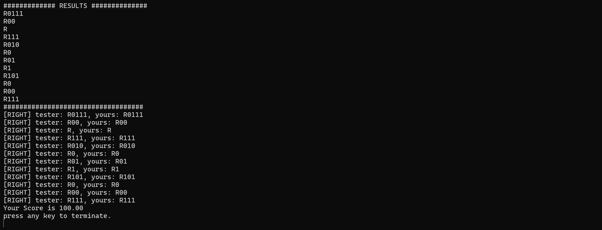

# 파일처리론 과제 #2 BST(Binary Search Tree) 구현

이 보고서는 **파이썬(python 3.12.7)** 에서 **BST(Binary Search Tree)** 기법을 구현한 `BinarySearchTree` 클래스를 포함한 다양한 코드 예제에 대한 설명과 사용 방법을 다룹니다.
**BST(Binary Search Tree)** 는 데이터를 효율적으로 관리하기 위해 다음과 같은 속성을 가진 이진 트리 자료 구조입니다. 

1. 이진 트리 구조
2. 각 `Node` **N<sub>i</sub>** 는 `Binary Key` 와  **K<sub>i</sub>** 를 실제 가지고 있는 `Record`에 대한 포인터를 포함
3. 공백이 아닌 `Binary Search`는 다음 성질을 만족함
    * 모든 `Node`는 상이한 `Key` 값들을 가짐
    * 모든 `Node` **N<sub>i</sub>** 에 대해 
        * **N<sub>i</sub>** 의 왼쪽 서브 트리 **(Left(N<sub>i</sub>))** 에 있는 모든 `Node`의 `Key` 값들은 **N<sub>i</sub>** 의 `Key` 값보다 작음
        * **N<sub>i</sub>** 의 오른쪽 서브 트리**(Right(N<sub>i</sub>))** 에 잇는 모든 `Node`의 `Key` 값들은 **N<sub>i</sub>** 의 `Key` 값보다 큼

    * 왼쪽 서브 트리와 오른쪽 서브 트리는 모두 `Binary Search Tree`

이 프로그램은 **BST(Binary Search Tree)** 를 구현하고, 이를 사용하여 삽입, 검색, 삭제 작업을 수행합니다. 프로그램은 입력 파일(`bst_input.txt`)에서 테스트 데이터를 읽고, 각 테스트 케이스를 처리한 결과를 출력 파일(`bst_output.txt`)에 기록합니다.


## Table of contents
1. [`Node` 클래스 개요](#Node-클래스-개요)
2. [`BinarySearchTree` 클래스 개요](#BinarySearchTree-클래스-개요)


---
## Node 클래스 개요

`BST`의 각 노드 정의

### 생성자
입력된 `newItem`와 `left`, `right`를 받아 `item`, `left`, `right`초기화

```python
    class Node: #BST의 Node
        def __init__(self, newItem, left, right):
            self.item = newItem #Key 값
            self.left = left    #왼쪽 자식 노드
            self.right = right  #오른쪽 자식 노드
```

* **입력 인자 :** 
    * `newItem` : `Node`의 `Key`값
    * `left` : `Node`의 왼쪽 자식 노드
    * `right` : `Node`의 오른쪽 자식 노드

* **작동 원리 :** 
    * `newItem`과 `left`, `right`를 입력 받아 해당 노드의 `item`, `left`, `right` 초기화

---
## BinarySearchTree 클래스 개요

**BST** 의 주요 기능인 `insert`, `search`, `delete` 구현 

### 생성자
root 생성
 ```python
 class BinarySearchTree:
    def __init__(self):
        self.__root = None
 ```

 ---
 ## insert 메서드

 **BST**의 루트(`self.__root`)를 기준으로 새로운 값 삽입

 ```python
    def insert(self, newItem):
        self.__root = self.__insertItem(self.__root, newItem)

 ```

 * **입력인자 :**
    * `newItem` : 삽입하려는 값

 * **작동원리 :**
    * `self.__insertItem(self.__root, newItem)`을 호출하여 트리의 루트를 기준으로 탐색과 삽입을 시작

---
## __insertitem 메서드
재귀적으로 **BST**의 적절한 위치를 찾아 새로운 값을 삽입

```python
        def __insertItem(self, bNode, newItem):
        if (bNode == None):
            bNode = Node(newItem, None, None)
        elif (newItem == bNode.item):
            return None
        elif (newItem < bNode.item):
            bNode.left = self.__insertItem(bNode.left, newItem)
        else:
            bNode.right = self.__insertItem(bNode.right, newItem)
        return bNode
```
 * **입력 인자:**
    * `bNode` : 현재 비교 중인 노드
    * `newItem` : 삽입 하려는 값

 * **작동 원리:** 
    * **조건 1 :** `bNode`가 비었을 경우, 새로운 노드를 생성하고 해당 위치에 `newItem` 삽입
    * **조건 2:** `newItem`의 값과 `bNode`의 값이 같을 경우, `None` 반환
    * **조건 3:** `newItem`의 값이 `bNode`보다 작을 경우, `bNode`의 왼쪽 자식의 노드를 `bNode`로 두고 `self.__insertItem(bNode.right, newItem)`호출하여 재귀적으로 삽입 위치 탐색

    * **조건 4:** `newItem`의 값이 `bNode`보다 클 경우, `bNode`의 왼쪽 자식의 노드를 `bNode`로 두고 `self.__insertItem(bNode.left, newItem)`호출하여 재귀적으로 삽입 위치 탐색

    * **재귀적 반환:**
    각 재귀 호출이 끝난 후, 부모 노드와의 연결 관계가 갱신되며 최종적으로 수정된 트리가 반환

---
## search 메서드

**BST**의 루트(`self.__root`)를 기준으로 차례대로 `key`검색

```python
     def search(self, key):
        self.searchResult = ['R']
        return self.__searchItem(self.__root, key)

```
* **입력 인자 :** 
    * `key` : 찾으려는 값

* **작동 원리 :** 
    * `self.searchResult = ['R']`
    * `self.__searchItem(self.__root, key)`을 호출하여 트리의 루트를 기준으로 탐색 시작
---

### 1. __searchItem 메서드

재귀적으로 **BST**에서 값을 `search` 하여 해당 위치를 특정 방식을 따르는 값으로 반환

```python
def __searchItem(self, bNode, key):
        if bNode is None:
            return None
        
        if (key == bNode.item):
            return self.searchResult
        elif (key < bNode.item):
            self.searchResult.append('0')
            return self.__searchItem(bNode.left, key)
        else:
            self.searchResult.append('1')
            return self.__searchItem(bNode.right, key)
```

* **입력 인자 :**

    * `bNode` : 현재 비교 중인 노드
    * `key` : 찾으려는 값

* **작동 원리 :**

    * **조건 1 :** `bNode`의 아이템이 비었을 경우 `None` 반환
    * **조건 2 :** `key`가 `bNode`의 아이템 값과 같을 경우
        * 현재까지 저장된 `searchResult` 반환
    * **조건 3 :** `key`가 `bNode`의 아이템 값보다 작을 경우
        * 경로를 왼쪽으로 이동 : `searchResult`에 경로 기록(0)
        * 왼쪽 자신노드로 이동해 재귀적으로 검색 진행
    * **조건 4 :** `Key`가 `bNode`의 아이템 값보다 클 경우
        * 경로를 오른쪽으로 이동 : `searchResult`에 경로 기록(1)
        * 쪽 자신노드로 이동해 재귀적으로 검색 진행


## delete 메서드
**BST**에서 `key`값 삭제 후 트리 구조 유지를 위해 노드 재구성 수행

```python
    def delete(self, key):
        self.__root = self.__deleteItem(self.__root, key)
```
* **입력 인자 :**
    * `key` : 삭제하려는 값

* **작동 원리**
    * * `self.__deleteItem(self.__root, key)`을 호출하여 트리의 루트를 기준으로 삭제 시작

---
## 1. __deleteItem 메서드 

삭제할 노드를 찾아 `__deleteNode`메서드를 통해 트리에서 제거한 후, 트리 재구성

```python
def __deleteItem(self, bNode, key):
        if bNode is None:  # bNode가 None이면 더 이상 진행할 수 없습니다.
            return None
        if (key == bNode.item):
            bNode = self.__deleteNode(bNode)
        elif (key < bNode.item):
            bNode.left = self.__deleteItem(bNode.left, key)
        else:
            bNode.right = self.__deleteItem(bNode.right, key)
        return bNode
```

* **입력 인자 :** 
    * `bNode` : 현재 비교 중인 노드
    * `key` : 삭제할 값

* **작동 원리 :**    
    * **조건 1 :** `bNode`의 아이템이 비었을 경우 `None` 반환
    * **조건 2 :** `key`가 `bNode`의 아이템 값과 같을 경우
        * 삭제를 위해 `self.__deleteNode(bNode)`호출
    * **조건 3 :** `key`가 `bNode`의 아이템 값보다 작을 경우
        * 경로를 왼쪽으로 이동 `bNode.left = self.__deleteItem(bNode.left, key)`
        * 왼쪽 자신노드로 이동해 재귀적으로 검색 진행
    * **조건 4 :** `Key`가 `bNode`의 아이템 값보다 클 경우
        * 경로를 오른쪽으로 이동 `bNode.right = self.__deleteItem(bNode.right, key)`
        * 쪽 자신노드로 이동해 재귀적으로 검색 진행
    * `return bNode` 반환과 동시에 재귀적을 노드가 재구성 됨

## 2. __deleteNode 메서드 

주어진 `bNode`를 삭제하고, 트리의 연결 관계 재구성

```python
 def __deleteNode(self, bNode):
        if (bNode.left == None and bNode.right == None):
            return None
        elif (bNode.left == None):
            return bNode.right
        elif (bNode.right == None):
            return bNode.left
        else:
            (rItem, rNode) = self.__deleteMinItem(bNode.right)
            bNode.item = rItem
            bNode.right = rNode
            return bNode
```

* **입력 인자 :** 
    * `bNode` : 삭제할 노드

* **작동 원리 :**    
    * **조건 1 :** 삭제 할 `bNode`의 자식노드가 없는 경우
        * `None` 반환
    * **조건 2 :** 삭제 할 `bNode`가 오른쪽 자식 노드만 있을 경우
        * `bNode`의 오른쪽 자식 노드 반환 
    * **조건 3 :** 삭제 할 `bNode`가 왼쪽 자식 노드만 있을 경우
        * `bNode`의 왼쪽 자식 노드 반환
    * **조건 4 :** 삭제할 `bNode`가 왼쪽, 오른쪽 자식 노드 모두 있을 경우
        * `(rItem, rNode) = self.__deleteMinItem(bNode.right)`를 통해 오른쪽 서브트리에서 가장 작은 값을 찾아 `bNode` 대체

## 3. __deleteMinItem 메서드 

서브트리에서 가장 작은 값을 찾아 반환

```python
def __deleteMinItem(self, bNode):
        if (bNode.left == None):
            return (bNode.item, bNode.right)
        else:
            (rItem, rNode) = self.__deleteMinItem(bNode.left)
            bNode.left = rNode

            return (rItem, bNode)
    
```

* **입력 인자 :** 
    * `bNode` : 서브트리의 루트 노드

* **작동 원리 :**    
    * **조건 1 :** `bNode`의 왼쪽 자식 노드가 없는 경우
        * `bNode.item`반환 
        * `bNode.right`를 반환하여 트리를 연결
    * **조건 2 :**  `bNode`의 왼쪽 자식 노드가 존재할 경우
        * 재귀적으로 왼쪽 자식을 탐색하여 가장 작은 노드 탐색

## Test Case처리 루프 설명
주어진 입력 파일(`bst_input.txt`)을 읽어 **BST**에 대해 삽입(insert), 검색(search), 및 삭제(delete) 작업을 수행 
결과를 출력 파일(bst_output.txt)에 저장

### 1. 파일 경로 설정
 
```python
from pathlib import Path # 상대경로 지정

# 파일 경로 설정
input_path = Path(__file__).parent / 'replacement_input.txt'
output_path = Path(__file__).parent / 'replacement_output.txt'
```
* **`input_path` :** 현재 파일의 디렉토리 기준으로 `replacement_input.txt`파일의 경로 설정

* **`output_path` :** 현재 파일의 디렉토리 기준으로 `replacement_output.txt`파일의 경로 설정

### 2. 입력 및 출력 파일 열기
```python
# input File & output File
input_r = open(input_path, 'r')
output_w = open(output_path, 'w')
```
* **`input_r` :** 읽기 모드로 `replacement_input.txt`파일 열기

* **`output_r` :** 쓰기 모드로 `replacement_output.txt`파일 열기 

### 3. 케이스 개수 읽기
```python
#Test Case 갯수
test_case = int(input_r.readline())
```
* **`test_case` :** 첫번째 줄에서 케이스의 개수를 읽어 저장

### 4. 주요 변수

```python
# 케이스 정보를 담을 리스트
test_case_values_amount = 0
test_case_values = []
test_case_search = []
```
* **`test_case_values_amount` :** 현재 Test Case에 삽입할 값의 개수 저장
* **`test_case_values` :** 현재 Test Case에 삽입할 값을 저장하는 리스트
* **`test_case_search` :** 현재 Test Case에서 실핸한 검색 작업의 결과를 저장하는 리스트

### 5. 각 케이스 처리 및 출력

```python
# 각 테스트 케이스에 대해 Eachcase 객체를 생성
or i in range(test_case):

        test = BinarySearchTree()

        #첫번째 insert
        test_case_values_amount = int(input_r.readline())
        test_case_values = list(map(int, input_r.readline().strip().split()))
        for value in test_case_values:
            test.insert(value)

        #초기화
        test_case_values = []
        
        #두번째 search
        test_case_values_amount = int(input_r.readline())
        test_case_values = list(map(int, input_r.readline().strip().split()))
        for value in test_case_values:
            test_case_search.append(test.search(value))

        #초기화
        test_case_values = []

        #세번째 delete
        test_case_values_amount = int(input_r.readline())
        test_case_values = list(map(int, input_r.readline().strip().split()))
        for value in test_case_values:
            test.delete(value)
            
        
        #초기화
        test_case_values = []
        
        #네번째 search
        test_case_values_amount = int(input_r.readline())
        test_case_values = list(map(int, input_r.readline().strip().split()))
        for value in test_case_values:
            test_case_search.append(test.search(value))
        
        test_case_values = []
```
* **작업 순서**
    * 1. BST 인스턴스 생성:
        * 각 테스트 케이스에 대해 새로운 BinarySearchTree 객체(test) 생성.
    * 2. 첫 번째 작업 (삽입):
        * 삽입할 값의 개수를 읽고, 해당 값을 리스트로 변환
        * 리스트의 각 값을 `test.insert(value)`를 통해 **BST**에 삽입
        * 작업 후 `test_case_values` 초기화
    * 3. 두 번째 작업 (검색):
        * 검색할 값의 개수를 읽고, 해당 값을 리스트로 변환.
        * 각 값을 test.search(value)를 통해 BST에서 검색.
        * 검색 결과(searchResult)를 test_case_search에 추가.
        * 작업 후 test_case_values 초기화.
    * 4. 세 번째 작업 (삭제):
        * 삭제할 값의 개수를 읽고, 해당 값을 리스트로 변환.
        * 각 값을 test.delete(value)를 통해 BST에서 삭제.
        * 작업 후 test_case_values 초기화.
    * 5. 네 번째 작업 (검색):
        * 삭제 후 트리에서 검색할 값의 개수를 읽고, 해당 값을 리스트로 변환.
        * 각 값을 test.search(value)를 통해 BST에서 검색.
        * 검색 결과(searchResult)를 test_case_search에 추가.
        * 작업 후 test_case_values 초기화.

### 6. 파일 닫기
```python
# 파일 닫기
input_r.close()
output_w.close()
```
* 모든 작업이 끝난 후 파일 닫기


## 파일 입출력 예시

### 입력 파일 예시(`replacement_input.txt`)

```python
1                                          # 각 케이스 개수
10                                         # 첫번째 작업(삽입)할 키의 개수
9 2 10 3 1 6 8 4 5 7                       # 첫번째 작업(삽입)을 할 키
2                                          # 두번째 작업(검색)할 키의 개수
8 1                                        # 두번째 작업(검색)을 할 키
5                                          # 세번째 작업(삭제)할 키의 개수
7 10 9 4 5                                 # 세번째 작업(삭제)을 할 키
2                                          # 네번째 작업(검색)을 키의 개수
2 8                                        # 네번째 작업(검색)을 할 키
```
#### 출력 파일 예시(`replacement_output.txt`)

모든 경로는 루트 노드를 표현하는 문자 “R” 로 시작
목적하는 키를 찾기 위해 각 노드에서 택해야 할 경로를 경로에 따라 “0” 혹은 “1” 로 표기
왼쪽 Subtree를 택했을 경우 “0”, 오른쪽 Subtree를 택했을 경우 “1”로 표기

```python
R0111
R00
R
R111
```

---
## 프로그램 실행 결과

### BST_tester 결과
Test1


Test2


Test3


Tester Result


### `replacement_input.txt` & `replacement_output.txt` 파일 결과
File Result


---
## 구현 과정의 난관과 해결 전략

### Search 결과 `searchResult`에 저장

* **문제점 :** 
    * `search`메서드의 결과로 반환하는 `searchResult`에서 이전 검색 작업의 데이터가 다음 검색 결과에 영햠을 미치는 문제 발생

* **해결 방법 :** 
    * `search` 메서드 호출 시 항상 `self.searchResult`를 ['R']로 초기화하여 독립적인 검색 결과를 보장
    ```python
    def search(self, key):
        self.searchResult = ['R']
        return self.__searchItem(self.__root, key)
    ```

### `searchResult` 파일에 저장

* **문제점 :** 
    * `searchResult`에 결과를 저장할 때 재귀가 풀리면서 'R'이 마지막에 저장됨

    * 초기 코드
    ```python
     def __searchItem(self, bNode, key):
        if bNode is None:
            return None
        if (key == bNode.item):
            self.searchResult.append('R')
            return self.searchResult
        elif (key < bNode.item):
            self.searchResult.append('0')
            return self.__searchItem(bNode.left, key)
        else:
            self.searchResult.append('1')
            return self.__searchItem(bNode.right, key)
    ```

* **해결 방법 :** 
    * `search` 메서드에서 `searchResult`를 초기화 할 때 `R`을 입력

    ```python
    def search(self, key):
        self.searchResult = ['R']
        return self.__searchItem(self.__root, key)


    def __searchItem(self, bNode, key):
        if bNode is None:
            return None
        
        if (key == bNode.item):
            return self.searchResult
        elif (key < bNode.item):
            self.searchResult.append('0')
            return self.__searchItem(bNode.left, key)
        else:
            self.searchResult.append('1')
            return self.__searchItem(bNode.right, key)
    ```

### delete 메서드 구현 
    
* **문제점 :** 
    * 삭제할 노드가 자식 노드를 갖고 있는 경우, 삭제 후 BST의 구조를 유지하는 과정이 복잡
    * 특히, 두 자식이 있는 노드의 삭제에서 적절한 대체 노드를 찾는 과정이 까다로웠음
    * 코드가 길어서 복잡해 보임
    * 메서드의 동작을 테스트할 때 결함을 찾기 어려움

    ```python
    def __deleteNode(self, bNode):
    if bNode.left is None and bNode.right is None:
        # 경우 1: 자식이 없는 경우
        return None
    elif bNode.left is None:
        # 경우 2: 오른쪽 자식만 있는 경우
        return bNode.right
    elif bNode.right is None:
        # 경우 3: 왼쪽 자식만 있는 경우
        return bNode.left
    else:
        # 경우 4: 두 자식이 모두 있는 경우
        # 오른쪽 서브트리에서 최소 노드를 찾아 삭제
        minNode = bNode.right
        minParent = bNode
        while minNode.left is not None:
            minParent = minNode
            minNode = minNode.left

        # bNode의 아이템을 최소 노드의 아이템으로 교체
        bNode.item = minNode.item

        # 오른쪽 서브트리에서 최소 노드를 제거
        if minParent.left == minNode:
            minParent.left = minNode.right
        else:
            minParent.right = minNode.right

        return bNode

    ```
   
* **해결 방법 :**
    * `__deleteNode`와 `__deleteMinItem`을 나누어 구현한 후 재귀를 통해 트리 재구성

    ```python
    def __deleteNode(self, bNode):
        if (bNode.left == None and bNode.right == None):
            return None
        elif (bNode.left == None):
            return bNode.right
        elif (bNode.right == None):
            return bNode.left
        else:
            (rItem, rNode) = self.__deleteMinItem(bNode.right)
            bNode.item = rItem
            bNode.right = rNode
            return bNode
        
    def __deleteMinItem(self, bNode):
        if (bNode.left == None):
            return (bNode.item, bNode.right)
        else:
            (rItem, rNode) = self.__deleteMinItem(bNode.left)
            bNode.left = rNode

            return (rItem, bNode)
    ```

### txt파일 데이터 가공
 * **문제점 :**
    * 입력 파일에서 데이터를 읽어들인 뒤, 이를 정수 리스트로 변환하고 BST 작업에 활용하는 과정에서 데이터 형식의 불일치로 인해 오류 발생

* **해결 방안 :**
    * strip()과 split()을 사용하여 데이터를 적절히 정제
    * map(int, ...)을 사용해 데이터를 정수형 리스트로 변환
    * 작업 후, 데이터가 남지 않도록 리스트를 초기화하여 재사용 문제를 방지

```python
    test_case_values = list(map(int, input_r.readline().strip().split()))
```

### 문제 해결에 대한 논의 
* 데이터 구조 수업 자료를 참고하여 **BinarySearchTree(BST)** 를 구현함.